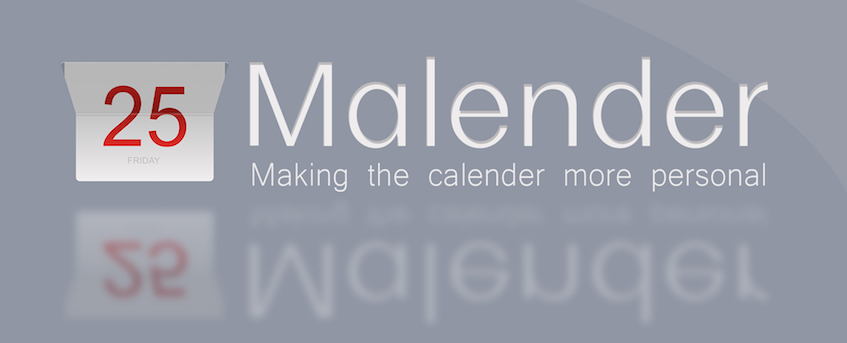
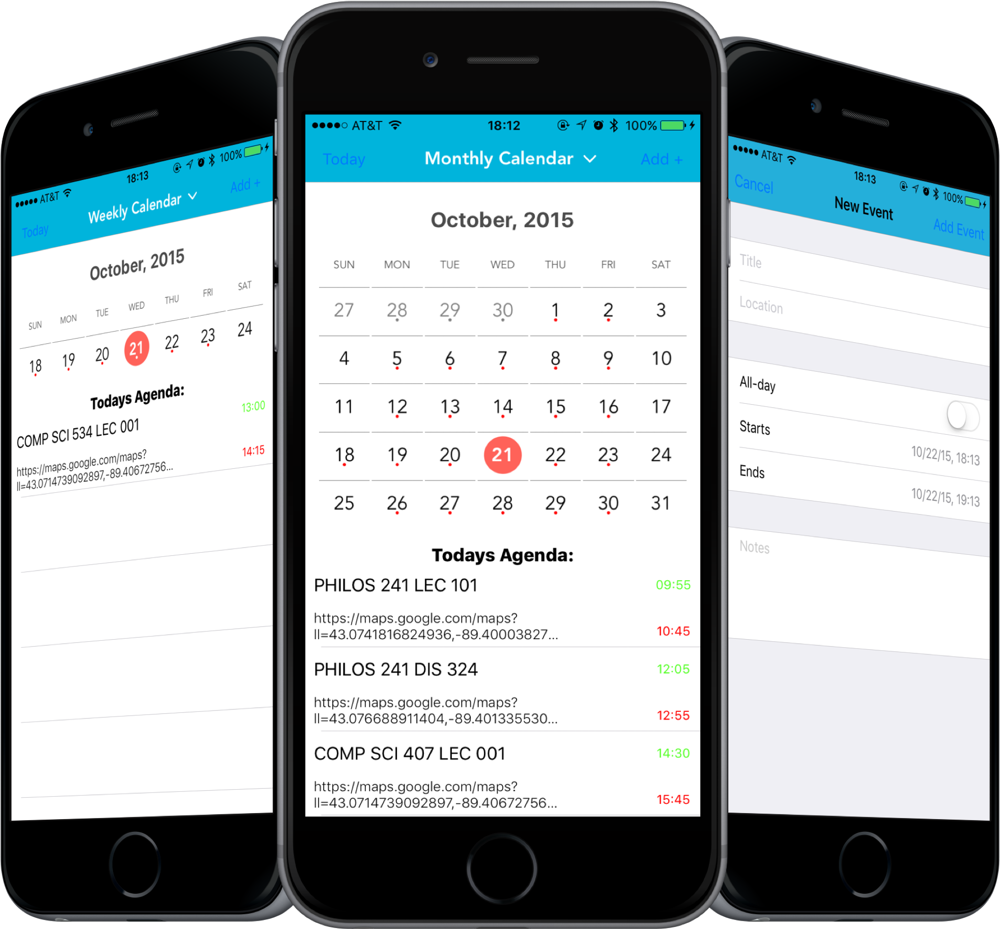

	
	
	

##Introduction
**Malendar** is a personal calendar app that connects to your default calendar and lets you add/delete events.  It will gather events from your default iOS calendar.

##Usage
* You are able to view your calendar in both weekly and monthly views.
	* Click the drop-down menu view at the top of the screen in order to toggle which view you would like to see.
* Add, Edit, and Delete events
	* Click on the add event button in the upper right-hand corner to add an event and watch it appear in your stock calendar
	* If there is an event you wish to delete, simply swipe right on said event in the table view and select the delete option
	* Same with editing an event - swipe right on the event and click edit, you will be prompted to enter the new information about the event
* Look for a red circle under a given date to determine if you have an event schedule for that day

##Screenshots

##Implemented / To-DO

- [ ] 3D Touch on event for preview
- [ ] Notifications
- [x] Weekly and Monthly views
- [x] Add and Edit Events
- [x] Dot markers on busy days
- [x] Single view calendar swiping